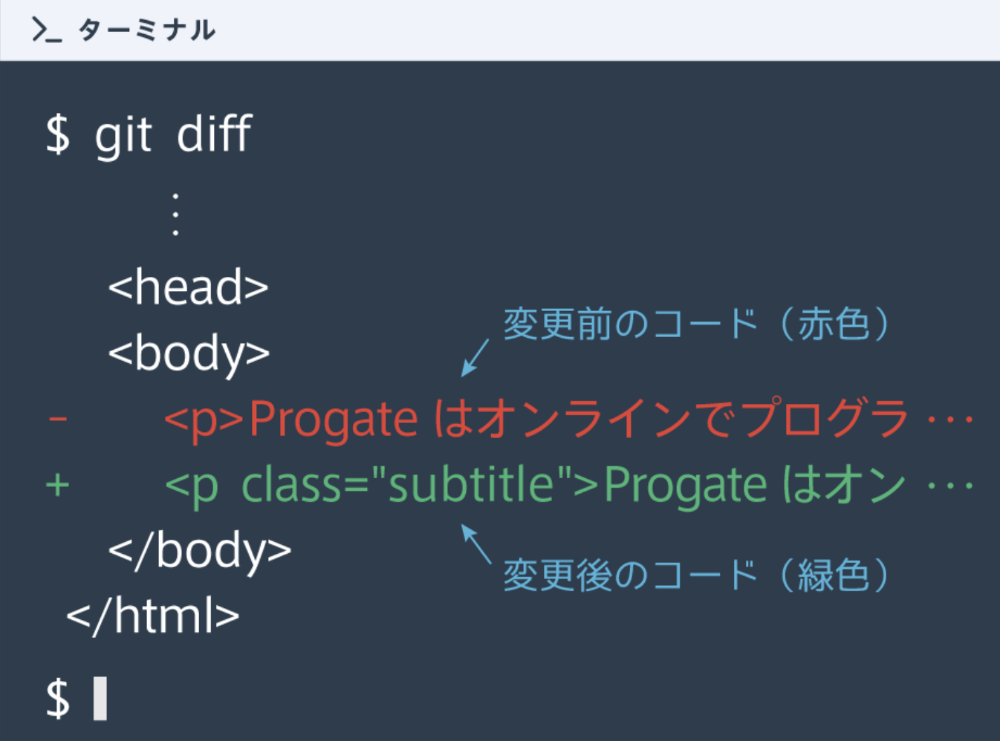
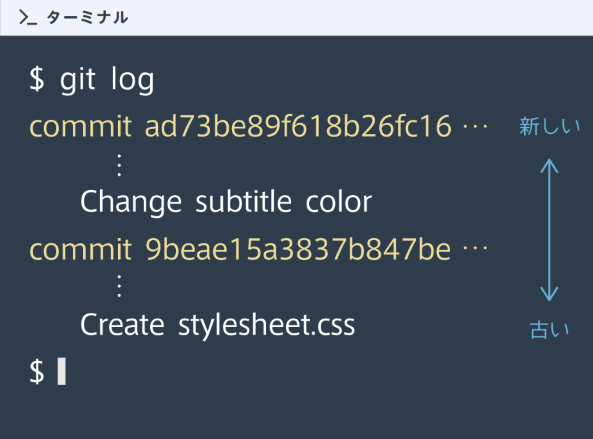

## Gitで大事なこと
共同開発では自分が行った変更を把握して、その変更の中で相手に共有すべき部分を選択できるようになることが大事

### ① 変更したファイルを把握
まずは自分がどのファイルを変更したか把握することが大切<br>
[ git status ]を用いることで、自分が変更したファイルのファイル名を表示することができる

```rb
$ git status
```
※[ modified: ファイル名 ]　変更があったファイルは赤字で表示される

### ② 変更内容を把握する
変更内容を把握するためには、[ git diff ]というコマンドが用意されている

```rb
$ git diff
```
※追加された部分が緑色で表示される

<details><summary>git diffの見方</summary>


</details>

### ③ addしたファイルを確認しよう
どのファイルを add したのか忘れた時は･･･<br>
・前に使った[ git status ]を使うことで、どのファイルを add していて、どのファイルがまだ add されていないかを確認することができる<br>
・「git status」を実行すると右の図のように、add されたファイルが緑色、まだ add されていないファイルが赤色で表示される

### ④ わかりやすいコミットメッセージを書く
コミットメッセージは他の人が見たときに、どんな変更を行ったかが分かりやすいように付けなければいけない<br>
× git commit -m "修正"<br>
◯ git commit -m "サブタイトルの色修正" 

### ➄ コミット履歴を確認する
### 変更履歴の確認（git log）
[ git log ]というコマンドを使うと、自分や他人のコミットを確認することができる（コミットメッセージも含む）<br>


### 変更内容の確認（git log -p）
変更内容が見たければ、[ git log -p ]を使用<br>
git log や git log -p では表示内容が多い時は特殊な表示モードになる<br>
！ 上下キーを使うと表示範囲を変えられて、Qキーを押すことで終了できる